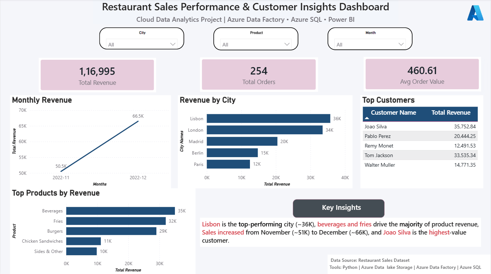

# Restaurant Sales Analytics Pipeline (Python + Azure + Power BI)

## Project Overview
This project demonstrates an end-to-end cloud data analytics pipeline built using Python, Azure Data Lake, Azure Data Factory, Azure SQL, and Power BI.

The goal of the project is to transform raw restaurant sales data into structured, analytics-ready insights that support business decision-making.

---

## Problem Statement
Raw sales data stored in CSV files cannot directly support business reporting or analytics. Businesses require a scalable pipeline to clean, organize, and transform raw data into structured insights for monitoring sales performance.

This project solves that problem by building a **Bronze-Silver-Gold data architecture on Azure** and delivering an interactive Power BI dashboard.

---

## Tech Stack

- Python (Pandas) – Data cleaning and preprocessing
- Azure Data Lake Storage Gen2 – Data storage
- Azure Data Factory – Data pipeline orchestration
- Azure SQL Database – Analytical data warehouse
- Power BI – Data visualization and dashboarding

---

## Data Architecture

Raw CSV Data  
↓  
Bronze Layer (Raw Data Storage)  
↓  
Silver Layer (Cleaned Data using Python)  
↓  
Azure Data Factory Copy Pipeline  
↓  
Azure SQL Database  
↓  
Gold Tables for Analytics  
↓  
Power BI Dashboard

---

## Data Pipeline

1. Raw restaurant sales dataset stored in **Azure Data Lake Bronze layer**
2. Data cleaned using **Python (Pandas)**
3. Cleaned data stored in **Silver layer**
4. **Azure Data Factory Copy Pipeline** transfers data to Azure SQL
5. Pipeline is **scheduled daily at 2:00 AM**
6. **Gold analytical tables** created in Azure SQL
7. Power BI connects to Azure SQL for visualization

---

## Dashboard Features

- Total Revenue KPI
- Total Orders KPI
- Average Order Value
- Monthly Revenue Trend
- Revenue by City
- Top Customers
- Top Products by Revenue
- Key Business Insights

---

## Key Insight

Lisbon is the top-performing city (~36K revenue), beverages and fries drive the majority of product sales, revenue increased from November (~51K) to December (~66K), and Joao Silva is the highest-value customer.

---

## Dashboard Preview

---

## Business Value

This solution enables restaurant management teams to:

- Track revenue performance
- Identify top customers
- Analyze product demand
- Monitor monthly sales trends
- Support data-driven business decisions

---

## Author

Ketan Dubey
